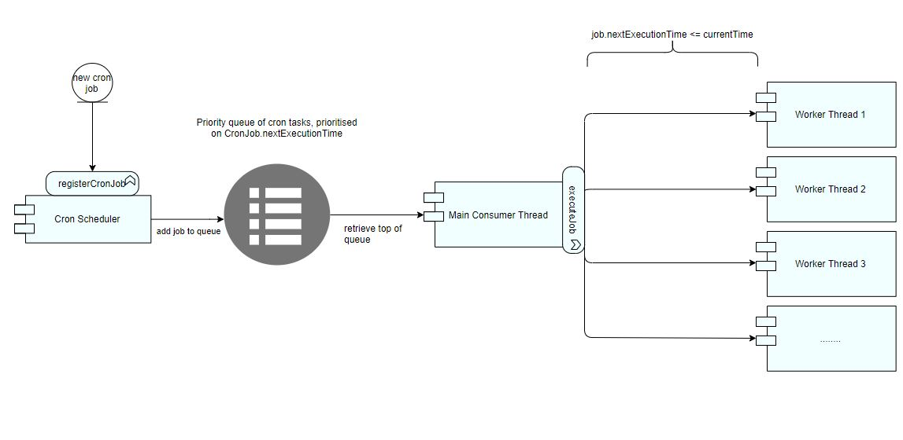

# Cron-Scheduler
A java library to create an in-process job scheduler, with n number of threads, to execute concurrent cron jobs

## Table of contents
* [Solution description](#solution-description)
* [Technical decisions](#technical-decisions)
* [Trade-offs](#trade-offs)
* [Example usage](#example-usage)
* [Future improvements](#future-improvements)


## Solution description
The scheduler follows a producer-consumer pattern. An illustration of the design overview is shown by the following diagram:



Algorithm works as follows:
```
- Clients call registerCronJob to register a new job with the CronScheduler.
- The CronScheduler pushes the job onto a priority queue that works based on the job's next execution time.
- Wihin the CronScheduler is a main job consumer thread which continuously monitors the top of the queue.
- It pulls out the job at the top of the queue and checks:
    if job.nextExecutionTime is after currentTime:
        push it back onto the queue.
        sleep for (currentTime - job.nextExecutionTime).
    else
        submit the cron job to an executor service to be executed asynchronously.
        Re-set job.nextExecutionTime = currentTime + schedulingFrequency.
        push it back onto the queue for next execution.
- Following registration, if the new cron job moves immediately to the top of the queue then:
    Wake up the sleeping main consumer thread to decide whether to run it or sleep for its shorter sheduling frequency.
```

## Technical decisions
* Java as the programming language of choice due to its familiarity, control provided by JVM and wide community usage.
* Allowing clients to specify the number of threads available to execute cron jobs
* Using FixedThreadPool which would be a good fit for tasks with unpredictable execution times like submitted cron jobs, unlike CachedThreadPool.
* Using Runnable to allow clients to pass in the functions to be executed. 
* Using Duration class in java for expected runtime and scheduling frequency over cron expressions.
* Usage of Java's CompletableFuture for asynchronous execution and easy chaining of callbacks. 
* If a function execution exceeds its expected runtime, kill it.
* Logs are written to both console and log files using SLF4J implemented by logback which is more performant and configurable than log4j. 

## Trade-offs
* Java application is not going to run as quick as a C++ for example, but we get other aspects for free such as garbage collection and safety.
* Specifying number of threads means that clients can better utilise their resources, but also possibly eating up resources if not careful.
* Duration representation might not be as flexible as using cron expressions, but much simpler than creating a cron parser and meets the required use case.

## Example usage
Include the library using maven

```xml
<dependency>
    <groupId>org.telda</groupId>
    <artifactId>cron-scheduler</artifactId>
    <version>${the.latest.version}</version>
</dependency>
```

Example code usage

```java
import java.time.Duration;
import java.util.UUID;

public class MyApplication {
    public static void main(String[] args) {
        CronScheduler cronScheduler = new CronScheduler(1000);
        cronScheduler.registerCronJob(Duration.ofMinutes(30), Duration.ofHours(1),
                () -> { System.out.println("my cron job"); }, UUID.randomUUID());
    }
}
```

## Future improvements
* Instead of using Duration representation, implement a cron parser for better scheduling flexibility.
* Make the cron scheduler more resilient by making it distributed and avoid a single point of failure.
* Introduce the ability to unregister a cron job. This would entail a priority queue implementation consisting of a heap and a hashmap of uid-positionInHeap to achieve O(log n) un-registration of jobs.
* Improve testing through the possible use of a framework like Cucumber which promotes BDD.
* Improve logging and monitoring. Save collected metrics into a time series database i.e influxDB. Use rolling file appenders.